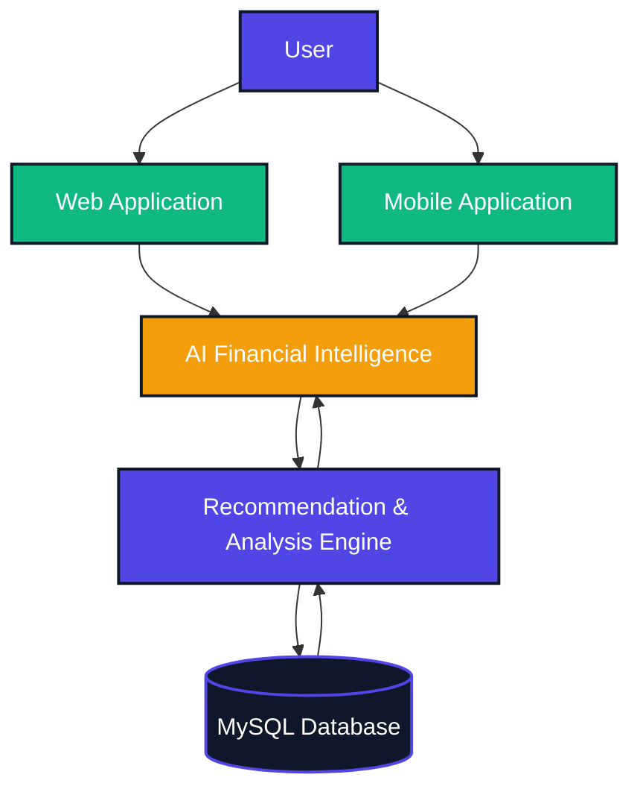
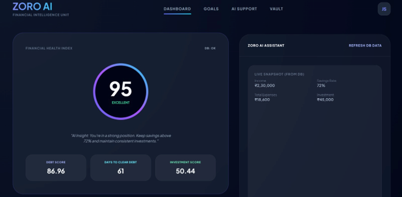
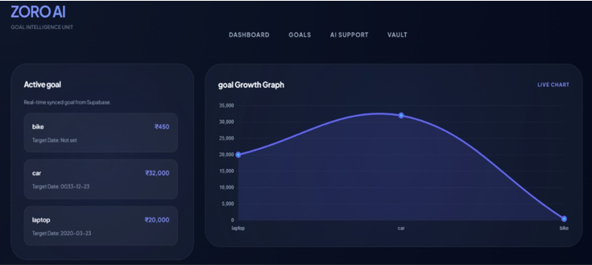
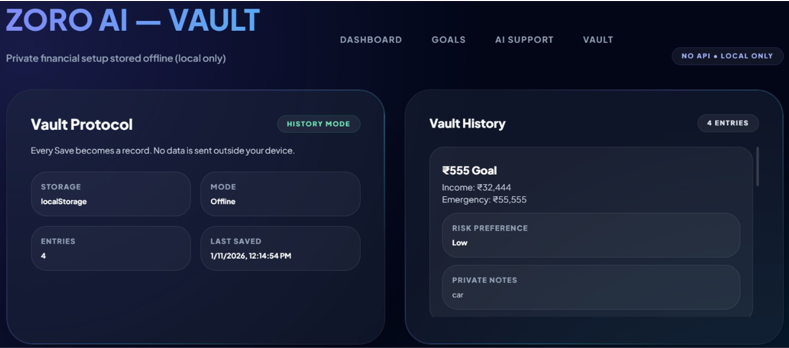

<div align="center">


<br>

<p>


</p>

<p>


</p>


</div>

# Overview

**ZORO AI** is an AI-powered Personal Finance Planning Platform designed to simplify financial decision-making through intelligent insights, goal-based planning, and personalized financial guidance.

Unlike traditional expense tracking applications that primarily display transactions and charts, **ZORO AI focuses on helping users make informed financial decisions.** The platform continuously analyzes financial information and transforms complex data into meaningful, actionable recommendations.

The platform combines a **Website** for financial planning and long-term analysis with a **Mobile Application** for everyday financial management, providing users with a unified and intelligent financial wellbeing ecosystem.

<div align="center">

</div>

# Problem Statement

Managing personal finances often requires constant mental calculations.

Users frequently ask themselves questions such as:

- Can I afford this purchase?
- Will I still achieve my savings goal?
- Am I spending too much this month?
- How should I adjust my budget?

Most existing finance applications provide historical data and visual charts but offer very little intelligent guidance.

This creates uncertainty, financial stress, and poor financial decision-making.

<div align="center">

</div>

# Our Solution

ZORO AI addresses this challenge by acting as an **AI-powered Financial Co-Pilot**.

Instead of only recording expenses, the platform analyzes user behavior, financial goals, spending habits, and savings patterns to provide personalized financial recommendations.

The objective is to reduce financial stress while helping users build healthy financial habits through intelligent planning and AI-assisted decision making.

<div align="center">

</div>

---

# Key Features

<div align="center">

</div>

### AI-Powered Financial Intelligence

- Personalized financial recommendations based on spending behavior.
- AI-generated financial insights to support better decision-making.
- Intelligent planning for long-term financial wellbeing.
- Financial health analysis through smart metrics.

---

### Financial Dashboard

The dashboard provides users with a comprehensive overview of their financial status.

Features include:

- Financial Health Score
- Spending Breakdown
- Savings Overview
- Investment Summary
- AI-generated Financial Insights
- Real-time Financial Overview

---

### Goal Management

Users can create and manage multiple financial goals.

Examples include:

- Buying a Laptop
- Purchasing a Bike
- Emergency Savings
- Vacation Planning
- Investment Targets

Each goal includes:

- Target Amount
- Progress Tracking
- Goal Completion Percentage
- AI Feasibility Analysis

---

### Secure Financial Vault

The Financial Vault enables users to securely manage important financial information.

Users can store:

- Monthly Income
- Savings Targets
- Emergency Fund
- Risk Preference

Additional capabilities:

- Plan Strength Score
- Remaining Financial Capacity
- Financial History Tracking
- Privacy-First Data Storage

---

### Website Platform

The web application serves as the primary financial planning platform.

Major modules include:

- User Authentication
- Financial Dashboard
- Goal Management
- Financial Vault
- AI Insights
- Financial Overview

---

### Mobile Application

The companion mobile application allows users to manage their finances anytime.

Key capabilities:

- Daily Expense Tracking
- Goal Monitoring
- Financial Overview
- AI Recommendations
- Real-Time Updates

---

### Privacy & Security

Security has been treated as a core design principle.

Features include:

- Privacy-First Architecture
- Secure User Authentication
- Read-Only Financial Access
- Local Data Protection
- Minimal Third-Party Data Sharing
- User-Controlled Financial Information

<div align="center">

</div>

# Technology Stack

<div align="center">


</div>

<br>

<div align="center">

| Layer | Technologies |
|---|---|
| **Frontend** | HTML5, CSS3, JavaScript, Bootstrap |
| **Backend** | PHP |
| **Database** | MySQL |
| **Tools** | Git, GitHub, XAMPP, VS Code |
| **Core Concepts** | AI, Financial Planning, Goal-Based Budgeting, Data Visualization, Software Engineering |

</div>

<div align="center">

</div>

# Project Highlights

| Feature | Description |
|---------|-------------|
| AI Insights | Intelligent financial recommendations |
| Dashboard | Complete financial overview |
| Goal Planning | Track multiple financial goals |
| Financial Vault | Secure financial profile management |
| Privacy First | Local and secure data handling |
| Website | Long-term planning and analysis |
| Mobile App | Everyday financial management |

<div align="center">

</div>

# System Architecture

GitHub renders the flowchart below natively — no image needed, and it scales cleanly on any screen.



The platform combines financial data, user-defined goals, and intelligent recommendations to deliver personalized financial guidance through a unified financial planning ecosystem.

<div align="center">

</div>

# Project Structure

```
zoro-ai
│
├── app/
│   ├── Controllers/
│   ├── Models/
│   ├── Views/
│   └── Core/
│
├── config/
│
├── public/
│   ├── assets/
│   ├── css/
│   ├── js/
│   └── images/
│
├── routes/
│
├── screenshots/
│
├── .env.example
├── .gitignore
└── README.md
```

<div align="center">

</div>

# Screenshots

> Dashboard

<p align="center">

</p>

---

> Financial Goals

<p align="center">

</p>

---

> Financial Vault

<p align="center">

</p>

<div align="center">

</div>

# Installation Guide

## Clone Repository

```bash
git clone https://github.com/dharmik-patel1511/zoro-ai.git
```

## Navigate to Project

```bash
cd zoro-ai
```

## Configure Environment

Copy the example configuration.

```text
.env.example
```

Create your own

```text
.env
```

and configure:

- Database Name
- Username
- Password
- Host

## Run using XAMPP

1. Start Apache
2. Start MySQL
3. Import the SQL database
4. Copy project inside

```
htdocs/
```

5. Visit

```
http://localhost/Zoro/public
```

<div align="center">

</div>

# Future Roadmap


- AI Financial Chat Assistant
- Smart Budget Prediction
- OCR Receipt Scanner
- Investment Portfolio Tracking
- Personalized Financial Reports
- Expense Forecasting
- Cloud Synchronization
- Real-Time Notifications
- Advanced Analytics Dashboard
- Mobile Application Enhancements

<div align="center">

</div>

# License

This project has been developed for educational, research, and portfolio purposes.

<div align="center">

</div>

# Author

<div align="center">


**Final-Year Information Technology Student**

Interested in

Software Development &nbsp;•&nbsp; Full-Stack Development &nbsp;•&nbsp; AI / ML &nbsp;•&nbsp; Data Analytics

<p>
<a href="https://www.linkedin.com/in/dharmikpatel-it">

</a>
</p>

</div>

<div align="center">

<br>


</div>
